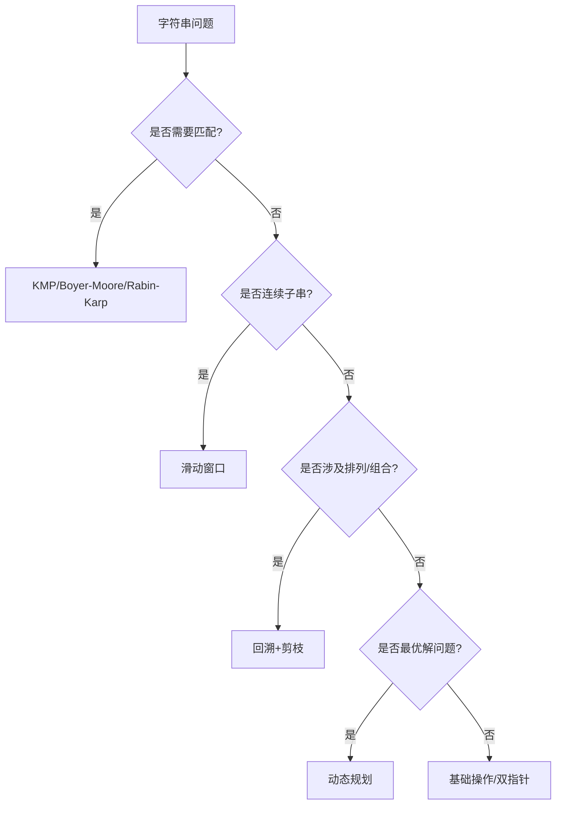

## 复杂度排序
O(1) < O(logn) < O(n) < O(nlogn) < O(n^2) < O(n^3) < O(2^n) < O(n!)

## 哪些算法
“分贪动回”：分治、贪心、动态规划、回溯。
“图数机随”：图算法、数论、机器学习、随机化。
基础算法：排序、搜索
字符串匹配算法
近似算法

算法可视化工具：https://visualgo.net/zh

POJ(北京大学题库)Codeforces(每周比赛) AI建议的ACM等竞赛的训练题库

| 分类             | 特点                     | 典型应用                 |
|------------------|--------------------------|--------------------------|
| 分治/贪心/DP     | 优化问题分解策略          | 排序、路径规划、资源分配 |
| 回溯/暴力        | 穷举所有可能 + 剪枝       | 排列组合、棋盘问题       |
| 图算法           | 处理节点与关系            | 社交网络、路由规划       |
| 近似/随机化      | 平衡效率与精确性          | 大规模优化、密码学       |

### 字符串类问题

| 分类               | 算法/技术          | 特点                                   | 典型应用                          | 代表题目/场景                     |
|--------------------|-------------------|----------------------------------------|-----------------------------------|----------------------------------|
| **基础匹配算法**    |                   |                                        |                                   |                                  |
|                    | 暴力匹配           | 逐字符比较，时间复杂度O(mn)            | 短文本匹配                        | C语言strstr()实现               |
|                    | KMP算法           | 利用部分匹配表跳过无效比较，O(m+n)      | 高效单模式匹配                    | [LeetCode 28](https://leetcode.com/problems/implement-strstr/) |
|                    | Boyer-Moore       | 从右向左匹配+坏字符规则                 | 文本编辑器搜索                    | GNU grep工具                    |
|                    | Rabin-Karp        | 基于滚动哈希的指纹匹配                  | 抄袭检测/多模式匹配               | 重复子串检测                    |
| **滑动窗口**        |                   |                                        |                                   |                                  |
|                    | 固定窗口           | 窗口大小不变                           | 定长子串统计                      | 长度为K的子串平均值             |
|                    | 可变窗口           | 动态调整窗口边界                       | 最优子串查找                      | [无重复字符最长子串](https://leetcode.com/problems/longest-substring-without-repeating-characters/) |
| **动态规划**        |                   |                                        |                                   |                                  |
|                    | 编辑距离           | 状态转移矩阵                           | 拼写纠错/相似度计算               | [LeetCode 72](https://leetcode.com/problems/edit-distance/) |
|                    | 最长公共子序列     | 二维DP表                               | 文件差异对比                      | Git差异比对                     |
|                    | 回文子串          | 中心扩展法/DP表                        | 回文相关问题                      | [最长回文子串](https://leetcode.com/problems/longest-palindromic-substring/) |
| **回溯与递归**      |                   |                                        |                                   |                                  |
|                    | 全排列生成         | 交换法/路径记录+剪枝                   | 排列组合问题                      | [字符串排列](https://leetcode.com/problems/permutations/) |
|                    | 括号生成           | 系统性地尝试所有合法组合                | 语法生成器                        | [LeetCode 22](https://leetcode.com/problems/generate-parentheses/) |
| **字典树与自动机**  |                   |                                        |                                   |                                  |
|                    | Trie树            | 前缀树结构，空间换时间                 | 搜索提示/单词检索                 | [实现Trie](https://leetcode.com/problems/implement-trie-prefix-tree/) |
|                    | AC自动机          | Trie+KMP的失败指针                     | 敏感词过滤系统                    | 网络安全过滤                    |
| **高级算法**        |                   |                                        |                                   |                                  |
|                    | Manacher算法      | 线性时间求最长回文子串                 | DNA序列分析                       | LeetCode 5最优解                |
|                    | 后缀数组          | 后缀排序+LCP数组                       | 基因组比对                        | 生物信息学                      |
| **辅助技术**        |                   |                                        |                                   |                                  |
|                    | 双指针             | 左右指针协同遍历                       | 反转/回文判断                    | [反转字符串](https://leetcode.com/problems/reverse-string/) |
|                    | 滚动哈希           | 多项式哈希+模运算                      | 快速子串比较                      | [重复DNA序列](https://leetcode.com/problems/repeated-dna-sequences/) |

ACM/蓝桥杯，被放弃了的算法

# ACM-ICPC核心算法分类表

## 基础算法

| 分类       | 核心内容                                   | 典型例题                          | 关键技巧                         |
|------------|-------------------------------------------|-----------------------------------|----------------------------------|
| 模拟       | 流程实现、大数运算                        | POJ 1001（高精度幂）              | 模块化编码                       |
| 排序       | 快排优化、归并逆序对                      | HDU 3743（逆序对应用）            | 随机化pivot                      |
| 二分       | 答案二分、边界查找                        | POJ 2456（最大化最小值）          | `while(l+1<r)`防死循环           |
| 贪心       | 区间调度、霍夫曼编码                      | UVa 11729（任务调度）             | 交换论证法                       |

## 数据结构
| 分类         | 关键点                                   | 经典问题                          | 优化技巧                         |
|--------------|-----------------------------------------|-----------------------------------|----------------------------------|
| 并查集       | 路径压缩+按秩合并                       | POJ 1182（食物链）               | 维护相对关系                     |
| 线段树       | 延迟标记、扫描线                        | HDU 1542（矩形面积并）            | 离散化坐标                       |
| 树状数组     | 动态前缀和维护                          | POJ 2352（Stars问题）             | 替代CDQ分治                      |
| ST表         | RMQ问题                                 | SPOJ RMQSQ                        | 块状预处理                       |

## 动态规划
| 类型         | 特征                                     | 例题                              | 状态设计技巧                     |
|--------------|-----------------------------------------|-----------------------------------|----------------------------------|
| 区间DP       | 枚举分割点                              | UVa 10003（切割木棍）             | `dp[l][r]`表示区间最优解         |
| 树形DP       | 子树信息统计                            | POJ 2342（公司派对）              | 选/不选当前节点                  |
| 状压DP       | 二进制表示状态                          | HDU 1074（作业调度）              | 预处理合法状态                   |
| 数位DP       | 逐位处理+记忆化                         | HDU 2089（不要62）                | `limit`标记处理上界              |

## 图论
| 算法         | 应用场景                                | 例题                              | 卡常技巧                         |
|--------------|-----------------------------------------|-----------------------------------|----------------------------------|
| Dijkstra     | 非负权最短路                           | POJ 3159（差分约束）              | 小根堆优化                       |
| SPFA         | 含负权最短路                           | POJ 3169（牛栏布局）              | SLF双端队列优化                  |
| Floyd        | 全源最短路                             | UVa 247（电话圈）                 | 最外层k不能调序                  |
| 网络流       | Dinic/费用流                           | POJ 1273（最大流）                | 当前弧优化                       |

## 数学与几何
| 领域         | 必备知识                                | 例题                              | 注意事项                         |
|--------------|-----------------------------------------|-----------------------------------|----------------------------------|
| 数论         | 欧拉定理、扩展欧几里得                  | POJ 2115（模线性方程）            | 负数取模处理                     |
| 组合数学     | 容斥原理、Lucas定理                     | HDU 3037（组合数取模）            | 预处理阶乘逆元                   |
| 计算几何     | 凸包、旋转卡壳                          | POJ 2187（最远点对）              | 浮点误差处理                     |

## 字符串
| 算法         | 典型应用                                | 例题                              | 加速策略                         |
|--------------|-----------------------------------------|-----------------------------------|----------------------------------|
| KMP          | 失配数组构建                            | POJ 2406（字符串周期）            | `next`数组从-1开始               |
| AC自动机     | 多模式串匹配                            | HDU 2222（关键词过滤）            | Trie图优化                       |
| 后缀数组     | SA/LCP数组                              | POJ 2774（最长公共子串）          | 基数排序                         |

